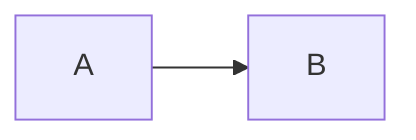

# Sirocco

A [Hugo](https://gohugo.io/) theme for a personal technical blog with a minimal section-driven layout.

## Features

- Section-first homepage (ordered and toggleable per section)
- Header navigation with bracketed active and hover states
- Section list pages with optional in-section indexes:
  - Series index
  - Tags index
- Taxonomy pages for `tags` and `series`
- Mermaid support from fenced code blocks
- Terminal-style code blocks with per-block opt-out shortcode
- Docker + Make based local workflow (no local Hugo required)

## Repository Structure

- `layouts/`
  - `_default/`: base, home, list, single, taxonomy, and term templates
  - `partials/`: shared header and footer
  - `shortcodes/`: custom markdown shortcodes (`noiterm2`)
- `static/`
  - `css/theme.css`: theme styles
- `archetypes/`
  - `default.md`: new article defaults
  - `section.md`: new section defaults
- `exampleSite/`
  - `hugo.yaml`: integration/test configuration
  - `content/`: sample content

## Requirements

- Docker
- GNU Make
- Git

## Usage

Use this repository as a Hugo theme and configure your site content and section front matter.

This theme is designed around:

- Global/site behavior in `hugo.yaml`
- Section behavior in `content/<section>/_index.md`
- Article content in page bundles:
  - `content/<section>/<YYYY>/<MM-DD-SLUG>/index.md`

## Install as Submodule

From your Hugo site root:

```bash
git submodule add https://github.com/yveyal/sirocco.git themes/sirocco
```

Then configure your `hugo.yaml` to use the theme:

```yaml
baseURL: "https://example.com/"
languageCode: "en-us"
title: "My Site"
theme: "sirocco"

taxonomies:
  tag: "tags"
  series: "series"

params:
  description: "A short site description."
  home_show_tags: true
  footer_text: "Brewed with Hugo."
  footer_alignment: "middle"
  social:
    - name: "GitHub"
      url: "https://github.com/your-user"
```

If your repository already has a `theme` key, replace it with:

```yaml
theme: "sirocco"
```

## Local Development

Run the example site locally:

```bash
make dev
```

This serves `exampleSite` at:

- `http://localhost:1313`

Build static output:

```bash
make build
```

Output directory:

- `dist/`

Cleanup generated artifacts:

```bash
make clean
```

## Configuration

### Home page intro source

The homepage intro renders the Markdown body from `content/_index.md`.

The home page front matter `title` and `description` remain available for metadata, but they are not shown in the visible intro block.

### Section controls

Define in `content/<section>/_index.md`:

- `show_in_menu`: show/hide the section in the header menu
- `show_in_menu_when_section_chosen`: list of section names that should reveal this section in the header when one of them is active
- `home_position`: integer order on homepage (`0` = top)
- `home_hidden`: hide/show section on homepage
- `show_series_index`: show/hide section series block
- `show_tags_index`: show/hide section tags block
- `description`: section description rendered on home/list pages

`show_in_menu_when_section_chosen` uses section directory names such as `posts`, `projects`, or `notes`.

### Site params (example)

From `exampleSite/hugo.yaml`:

- `params.description`
- `params.home_show_tags`
- `params.footer_text` (rendered as-is in footer)
- `params.footer_alignment` (`left`, `middle`, or `right`; default: `left`)
- `params.social`

## Archetypes

Included archetypes:

- `archetypes/default.md` for article content
- `archetypes/section.md` for section `_index.md`

Examples:

```bash
hugo new posts/$(date +%Y)/$(date +%m-%d)-my-post/index.md
hugo new --kind section posts/_index.md
```

## Shortcodes

### noiterm2

Disables terminal-style wrapper for a specific code block.

````text

```bash
echo "plain code block"
```

````

## Mermaid

Mermaid blocks are rendered automatically:

````text

````

## Contributing

- Keep backward compatibility for existing `hugo.yaml` and section `_index.md` structures.
- Any new visual feature must be configurable.
- New features should be disabled by default.
- Prefer reusable partials over duplicate template logic.
- Avoid unnecessary dependencies.
