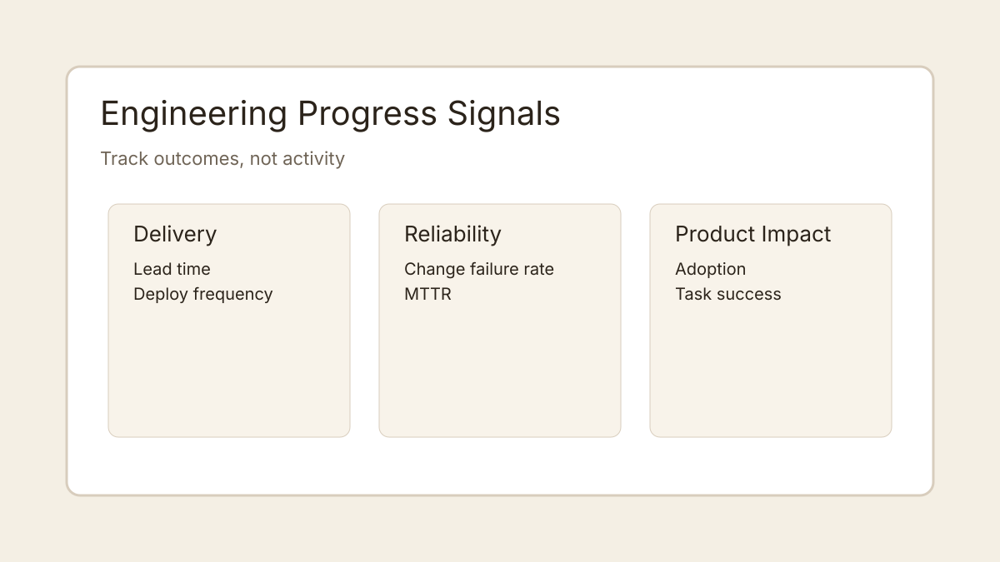
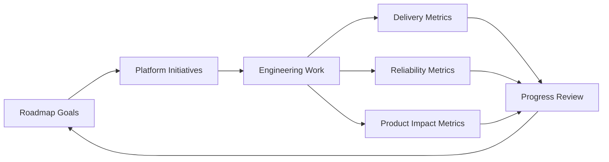

Engineering progress in AI systems is hard to measure if you track activity instead of outcomes. The strongest teams use a small set of leading and lagging indicators.

## A balanced progress model

Use three lanes:

- **Delivery**: lead time and deploy frequency.
- **Reliability**: change failure rate and time-to-recover.
- **Product impact**: adoption and task success.

The key is to review these together, not in isolation.

## Example architecture diagram (Mermaid)

If your Hugo setup does not render Mermaid yet, keep the diagram block in content and add client-side Mermaid initialization later.
