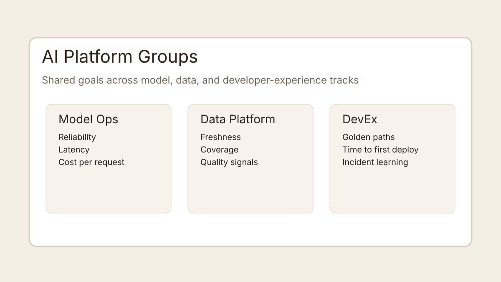
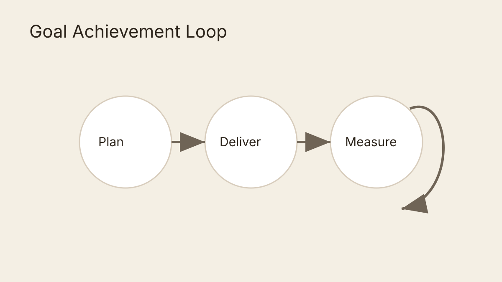

Platform groups often fail not because they lack talent, but because each team optimizes a different local metric. The fix is a shared goal tree and a repeatable execution loop.

## A practical goal model

A useful split is:

- **North star outcomes**: reliability, developer velocity, and unit economics.
- **Team-level commitments**: what each platform group must deliver this quarter.
- **Operational indicators**: weekly signals to detect drift early.

For AI-heavy organizations, this keeps model operations, data platform, and developer-experience teams moving in the same direction.

## What to review every month

1. Did we reduce cognitive load for product teams?
2. Are latency and quality improving together?
3. Is the cost curve flattening while adoption grows?

When these are reviewed jointly, platform work shifts from backlog pressure to outcome ownership.
