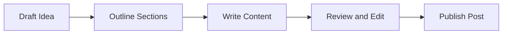

This post is a rendering reference for common content patterns in the theme.

## Table of contents

1. Headings
2. Paragraph and emphasis
3. Lists
4. Code and preformatted blocks
5. Tables
6. Quotes and separators
7. Mermaid diagrams
8. Media and links
9. Inline HTML elements

# H1 Heading

## H2 Heading

### H3 Heading

#### H4 Heading

##### H5 Heading

###### H6 Heading

## Paragraph and emphasis

````text 
Regular paragraph text for long-form reading. This includes **bold**, *italic*, ***bold italic***, `inline code`, and ~~strikethrough~~.

You can also include footnotes for technical writing.[^1]
````


Regular paragraph text for long-form reading. This includes **bold**, *italic*, ***bold italic***, `inline code`, and ~~strikethrough~~.

You can also include footnotes for technical writing.[^1]

## Lists

### Unordered list

````text
- First item
- Second item
  - Nested item A
  - Nested item B
- Third item
````



- First item
- Second item
  - Nested item A
  - Nested item B
- Third item

### Ordered list

````text 
1. Step one
2. Step two
3. Step three
````

1. Step one
2. Step two
3. Step three

### Task list

````text 
- [x] Create markup examples
- [x] Keep YAML front matter
- [ ] Add screenshot assets later
````

- [x] Create markup examples
- [x] Keep YAML front matter
- [ ] Add screenshot assets later

## Code and preformatted blocks

Inline command example: `make check`

```bash 
# Dockerized Hugo check
make check

# Local preview
make dev
```

```json
{
  "name": "sirocco",
  "type": "theme",
  "status": "demo"
}
```

## Tables

| Element | Purpose | Notes |
| --- | --- | --- |
| `h1`-`h6` | Headings | Document hierarchy |
| `ul` / `ol` | Lists | Supports nesting |
| `table` | Tabular data | Keep concise on mobile |
| `code` | Inline code | Technical text |

| Breakpoint | Width | Behavior |
| --- | ---: | --- |
| Mobile | `<768px` | Single-column flow |
| Tablet | `>=768px` | Comfortable spacing |
| Desktop | `>=992px` | Max readable line length |

## Quotes and separators

> Minimal, readable, and technical is the default voice for this theme.

---

## Mermaid diagrams

The diagram above is produced by a fenced code block with the `mermaid` language identifier:

````text {linenos=inline}

````



## Media and links

Example external link: [Hugo Documentation](https://gohugo.io/documentation/).

Example internal link: [Posts section](/posts/).

## Inline HTML elements

<mark>Highlighted text</mark>, <abbr title="HyperText Markup Language">HTML</abbr>, and <kbd>Ctrl</kbd>+<kbd>K</kbd>.

Chemical formula: H<sub>2</sub>O. Math power: x<sup>2</sup>.

<details>
  <summary>Expandable details block</summary>
  <p>This is useful for optional technical notes, caveats, or long snippets.</p>
</details>

<pre>
Raw preformatted text block.
Spacing and line breaks should be preserved.
</pre>

[^1]: Footnote rendering depends on the configured Markdown renderer.
